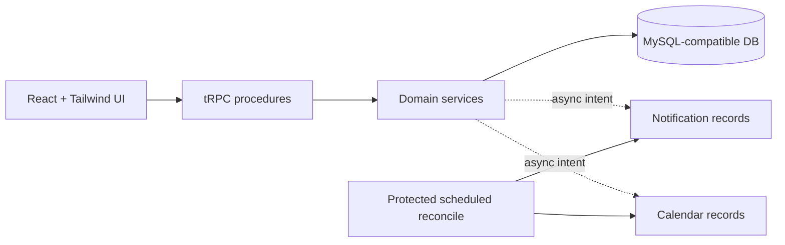

# Careline — Healthcare Appointment & Follow-up Manager

Careline is a production-style healthcare workflow platform for **patients**, **doctors**, and **administrators**. It combines concurrency-safe scheduling with symptom intake, clinician workflows, auditable operations, resilient notifications, and optional Google Calendar and AI capabilities.

## Why it exists

Appointment software fails patients when availability is merely a visual promise. Careline treats a time as a protected database resource. A five-minute hold is enforced by a unique database constraint and transactional confirmation rather than by a disabled browser button. The result is a clearer workflow when two people request the same time: one booking succeeds, while the other receives a recoverable conflict message.

| Capability | What is implemented |
|---|---|
| Identity and access | Managed OAuth plus server-side `patient`, `doctor`, and `admin` roles; profile ownership checks are performed in procedures. |
| Scheduling | Working-hour and timezone validation, approved leave checks, five-minute holds, explicit overlap queries, unique slot protection, booking, cancellation, and rescheduling. |
| Clinical workflow | Symptom intake, urgency summary generation, doctor queue, clinical notes, prescriptions, patient-friendly follow-up summaries, and medication-reminder records. |
| Reliability | Persistent notification states with retry/backoff, audit records, a protected reconciliation endpoint, and isolated Calendar/LLM operations. |
| Interface | Editorial public landing page; responsive role-aware workspaces with accessible controls, states, badges, and toast feedback. |

## Architecture



The codebase follows the scaffold’s typed router architecture while maintaining a service layer for the scheduling, notification, Calendar, and LLM boundaries. See [system design](docs/system-design.md), [database design](docs/database.md), [API contract](docs/api.md), [LLM design](docs/llm-prompts.md), [environment configuration](docs/environment.md), and the [submission evaluation](docs/submission-evaluation.md) for the detailed design and verification record.

## Local setup

Start the database, provide the variables documented in [environment configuration](docs/environment.md) through your local environment or deployment platform, then install dependencies and start the project. The managed workspace intentionally keeps secret values out of the repository; the environment guide is the safe public template for a standalone clone.

```bash
export MYSQL_DATABASE=careline MYSQL_USER=clinic_user MYSQL_PASSWORD='choose-a-local-password' MYSQL_ROOT_PASSWORD='choose-a-different-local-root-password'
docker compose up -d
pnpm install
pnpm drizzle-kit generate
pnpm db:push
node server/seed.mjs
pnpm dev
```

The template uses a MySQL-compatible database rather than Prisma/PostgreSQL because it builds on the managed full-stack scaffold already present in this workspace. The migration source lives in `drizzle/`, and the application schema is in `drizzle/schema.ts`.

## Demo data and roles

`node server/seed.mjs` creates three clinician profiles with weekday working hours: Dr. Helena Ward (Family Medicine), Dr. Amir Patel (Cardiology), and Dr. Sofia Chen (Dermatology). It intentionally does **not** seed fake passwords or OAuth identities. In this deployment, a person must sign in through the real authentication flow. The project owner is automatically created as an administrator; an administrator can assign a verified authenticated user to a doctor profile, which promotes the account to doctor role.

## Optional integrations

When email credentials are absent, notification records stay truthful: they progress through retry states and can become failed rather than being marked sent. When Google credentials are absent, Calendar state is `not_configured` and appointments continue normally. To use Calendar, configure `GOOGLE_CLIENT_ID`, `GOOGLE_CLIENT_SECRET`, and `GOOGLE_REDIRECT_URI`; the callback path is `/api/integrations/google/callback`.

The scheduled reconciliation handler is ready at `/api/scheduled/healthcare-reconcile`. After deploying the project, create a platform-managed recurring task that calls this endpoint—for example, every five minutes—to expire holds, process notification retries, generate medication delivery intents, and sync pending calendar operations. Do not use an in-process timer in production.

## Quality checks

```bash
pnpm check
pnpm test
pnpm build
pnpm drizzle-kit generate
```

The automated suite covers session logout, role protection, expired holds, concurrent slot locks, leave cancellation, notification retry state, slot validation, structured LLM output, and the explicitly labelled local fallback. Booking uses explicit overlap checks plus the unique database slot-lock index as the final authority in a simultaneous request.

## Security and failure boundaries

Passwords and role data are never accepted from the frontend. Authenticated user context establishes identity; procedure-level role checks and per-record ownership checks protect sensitive actions. Booking is committed before any notification, LLM, or Calendar task begins. Errors therefore remain contained to their integration records and do not reverse an appointment.
