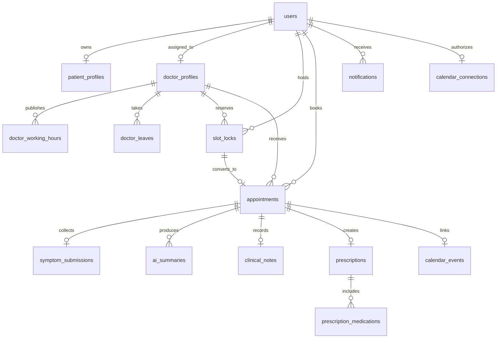

# Database Design

Careline stores core identifiers as UUIDs, except for the scaffold-owned authenticated `users` surrogate key. All appointment timestamps are persisted as UTC timestamps; each doctor and appointment also records an IANA timezone for presentation and local working-hour evaluation.

| Area | Primary tables | Integrity focus |
|---|---|---|
| Identity | `users`, `patient_profiles`, `doctor_profiles` | Role and profile ownership are linked server-side. |
| Scheduling | `doctor_working_hours`, `doctor_leaves`, `slot_locks`, `appointments` | A unique doctor-start lock protects the slot race. |
| Clinical care | `symptom_submissions`, `ai_summaries`, `clinical_notes`, `prescriptions`, `prescription_medications` | One symptom submission and one clinical note per appointment. |
| Operations | `notifications`, `medication_reminders`, `calendar_events`, `calendar_connections`, `audit_logs` | Durable integration state and audit history. |

The primary booking constraint is `slot_lock_doctor_start_unique`. An active hold or booked lock occupies the same resource. `appointments.slotLockId` is unique, tying a confirmed appointment to the lock that won the race. Foreign keys define cascade behavior deliberately: private patient profile data may cascade when its authenticated user is removed, while clinical appointment links use restrictive relationships to avoid accidental deletion.
